<h1 align="center"> Hi there, I'm Simon! </h1>

I'm a PhD student working in the exciting field of neuromorphic computing. With a deep interest in the intersection of neuroscience and computer science, I am dedicated to exploring and advancing the capabilities of neuromorphic systems to create brain-inspired computing solutions.

<!--  -->

<h4 align="center"><u>Links</u></h4>

## Research Focus

My research primarily revolves around the following areas:

- ⚡️**Spiking Neural Networks (SNNs)**: Exploring the dynamics and learning mechanisms of SNNs is a key aspect of my work. I'm interested in studying spike-based learning technique for energy-efficient information processing.

- 🔋**Ultra-low power algorithms**: I am actively engaged in developing and optimizing sub-milliwatt ML algorithms for for edge and neuromorphic hardware platforms.

- 📊 **Benchmarking**: I'm trying to clear up the jungle that is edge computing by developping benchmarking tools and techniques.

## Repository Highlights

Feel free to explore (and contribute to!) some of the projects and repositories I've been working on:

- 🔥 [NeurIO](https://github.com/csem/NeurIO): a Python library for easy deployment of neural networks on edge devices, allowing ultra low power inference 🧠
- 🆕 [AudioGPT](https://github.com/Narduzzi/audio-gpt): An vocal interface to ChatGPT
- [BrainDish Simulator](https://github.com/hugoladret/BrainDishSiMulator): The attempt from [Hugo](https://github.com/hugoladret) and I to create AGI out of Pong and a microcontroller. 🧪
- [Tensorflow Deterministic](https://github.com/Narduzzi/tensorflow-deterministic) : Example for reproducible Tensorflow/Keras experiments ♻️
- [This game](https://github.com/Narduzzi/StartHack2018) and [this one](https://github.com/Narduzzi/GGJ2020): Developed during hackathons and game jams🕹

## Get in Touch

I'm always eager to connect with fellow researchers and AI enthusiasts. Drop me an email at simon.narduzzi@gmail.com or connect with me on [LinkedIn](https://linkedin.com/in/narduzzi/) and [Bluesky](https://bsky.app/profile/narduzzi.bsky.social) 👋

Let's push the boundaries of neuromorphic computing together!

<h3 align="center">Thank you for visiting my GitHub profile! </h3>

  

